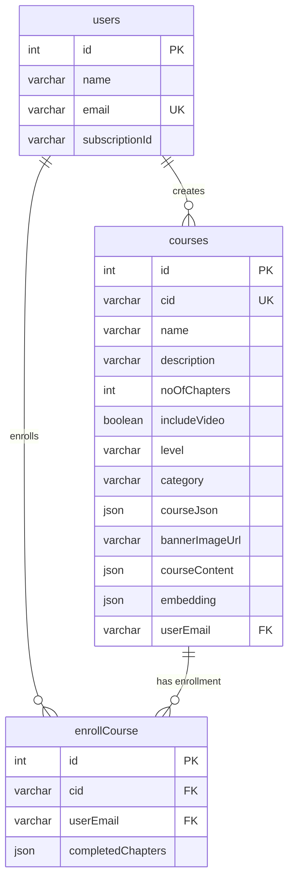
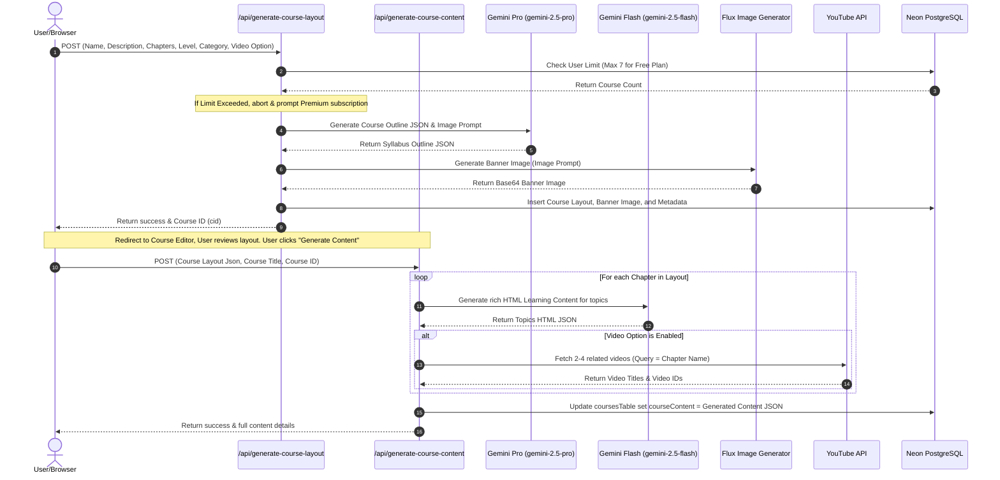

# In-Depth Project Architecture

This document provides a comprehensive, in-depth architectural breakdown of the **Online Learning Platform with RAG Chatbot**. It explains the system's design, technology stack, database schemas, API routing, frontend state management, and the AI/RAG (Retrieval-Augmented Generation) pipeline.

---

## 🗺️ Architectural Overview

The application is structured as a hybrid full-stack Next.js project with an optional standalone Express backend. It follows a serverless API model for frontend interaction and uses a PostgreSQL database with vector capabilities (`pgvector`) for storing course content and semantic search embeddings.

```mermaid
graph TD
    %% Clients
    User([Student/Educator]) -->|Interacts| Client[Next.js React Client]

    %% Next.js Front-End & Services
    subgraph NextJS [Next.js App Workspace]
        Client -->|App Routes| Pages[Pages & Layouts]
        Client -->|Authentication| Clerk[Clerk Auth Provider]
        Pages -->|Context State| Contexts[React Contexts]
    end

    %% Database Layer
    subgraph DatabaseLayer [Database Layer]
        DB[(Neon PostgreSQL Database)]
        Drizzle[Drizzle ORM] -->|Queries & Operations| DB
        DB -.->|pgvector Extension| VectorIdx[IVFFlat Index]
    end

    %% Next.js Serverless API
    subgraph NextJS_API [Next.js Serverless Endpoints]
        API_User[/api/user]
        API_Courses[/api/courses]
        API_Enroll[/api/enroll-course]
        API_Layout[/api/generate-course-layout]
        API_Content[/api/generate-course-content]
        API_Chatbot[/api/chatbot]
    end

    %% Standalone Backend
    subgraph StandaloneBackend [Express Backend]
        ExpServer[Express server.js]
        ExpRAG[RAG Engine chatbotBackend.js]
        ExpServer --> ExpRAG
    end

    %% External Services
    subgraph AIServices [External APIs & Models]
        GeminiPro[Gemini Pro / gemini-2.5-pro]
        GeminiFlash[Gemini Flash / gemini-2.5-flash]
        GeminiEmbed[text-embedding-004]
        Flux[Flux Image Model / AIGuruLab]
        YoutubeAPI[YouTube Search API]
    end

    %% Connections
    Pages -->|HTTP Requests| NextJS_API
    API_User --> Drizzle
    API_Courses --> Drizzle
    API_Enroll --> Drizzle
    
    API_Layout -->|Syllabus Prompt| GeminiPro
    API_Layout -->|Image Prompt| Flux
    API_Layout --> Drizzle
    
    API_Content -->|Generate HTML| GeminiFlash
    API_Content -->|Search Videos| YoutubeAPI
    API_Content --> Drizzle

    API_Chatbot -->|RAG Ingest/Query| NextJS_RAG[Next.js lib/chatbotBackend.js]
    NextJS_RAG -->|Generate Embeddings| GeminiEmbed
    NextJS_RAG -->|Vector Search| DB
    NextJS_RAG -->|Generate Answer| GeminiFlash

    ExpRAG -->|Vector Search| DB
    ExpRAG -->|Generate Embeddings| GeminiEmbed
    ExpRAG -->|Generate Answer| GeminiPro
```

---

## 🗄️ Database & Schema Design

The database resides in a **Neon Serverless PostgreSQL** instance. Tables and connections are managed using **Drizzle ORM**.

### Entity Relationship Diagram (ERD)




### 1. Database Tables (Defined in `config/schema.js`)

#### `usersTable` (PostgreSQL Table: `"users"`)
Stores registered users.
- `id` (integer, Primary Key): Automatically generated always as identity.
- `name` (varchar): User's full name.
- `email` (varchar, Unique, Not Null): Main key for fetching profiles.
- `subscriptionId` (varchar): Nullable field tracking premium user status.

#### `coursesTable` (PostgreSQL Table: `"courses"`)
Stores generated course outlines, contents, and RAG embeddings.
- `id` (integer, Primary Key): Automatically generated always as identity.
- `cid` (varchar, Unique, Not Null): UUID generated on the client side representing the course.
- `name` (varchar): Course title.
- `description` (varchar): Summary of the course.
- `noOfChapters` (integer, Not Null): Total chapters.
- `includeVideo` (boolean): Toggle for including video lectures (via YouTube search).
- `level` (varchar, Not Null): Difficulty level (e.g., Beginner, Moderate, Advance).
- `category` (varchar): Main course category tag.
- `courseJson` (json): Contains the structural course outline generated in phase 1 (chapters, duration, topics list).
- `bannerImageUrl` (varchar): Base64 encoded or external URL of the AI-generated course banner illustration.
- `courseContent` (json): Fully generated chapters including the YouTube video metadata and generated HTML lessons.
- `embedding` (json/vector): 768-dimension vector representation of the course text content.
- `userEmail` (varchar): Foreign key pointing to `usersTable.email`.

#### `enrollCourseTable` (PostgreSQL Table: `"enrollCourse"`)
Tracks student enrollment and course completion progress.
- `id` (integer, Primary Key): Automatically generated always as identity.
- `cid` (varchar): Foreign key referencing `coursesTable.cid`.
- `userEmail` (varchar): Foreign key referencing `usersTable.email`.
- `completedChapters` (json): Array storing indexes of completed chapters (e.g. `[0, 1]`).

---

## 🧠 AI Integration & RAG Pipeline

The RAG (Retrieval-Augmented Generation) system provides contextually accurate course information without hallucination.

### RAG Flowchart

```mermaid
flowchart TD
    subgraph Ingestion_Flow [Ingestion Pipeline]
        A[Course JSON Content] -->|1. Parse text fields| B[Concatenated Text Chunks]
        B -->|2. Send text| C[Gemini text-embedding-004]
        C -->|3. Return 768d Vector| D[PostgreSQL courses.embedding]
    end

    subgraph Query_Flow [RAG Chat query Pipeline]
        E[User Query Text] -->|1. Send query| F[Gemini text-embedding-004]
        F -->|2. Return 768d Vector| G[pgvector Vector Match]
        G -->|3. Order by Cosine Distance <=>| H[(Neon PostgreSQL DB)]
        H -->|4. Retrieve Top 3 Context Chunks| I[Filter & Join Context]
        I -->|5. Merge with System Instructions| J[Construct Prompt]
        K[User Query + Chat History] --> J
        J -->|6. Send final prompt| L[Gemini Flash API]
        L -->|7. Generate Answer| M[Markdown Output to Frontend Client]
    end
```



```
Ingestion Phase:
[Course Content JSON] ──> Extract Text ──> [Gemini text-embedding-004] ──> 768d Vector ──> Save in PG (embedding column)

Querying Phase:
[User Question] ──> [Gemini text-embedding-004] ──> Query Vector ──> Vector similarity match (pgvector <=>) ──> Context Chunks
                                                                                                                │
                                                                                                                ▼
[System Prompt + Context Chunks + Question] ──> [Gemini Flash API] ──> Answer Markdown to Client
```


### 1. Vector Search Pipeline (`lib/chatbotBackend.js` & `backend/chatbotBackend.js`)
- **Embedding Model**: `text-embedding-004` (768 dimensions).
- **Generation Model**: `gemini-flash-latest` (frontend) / `gemini-pro` (Express backend).
- **Distance Metric**: Cosine Distance (`<=>`) is utilized for semantic searches.

#### Step 1: Content Ingestion
When ingestion is triggered (either manually or programmatically via `PUT /api/chatbot`), the application:
1. Queries the database to fetch courses.
2. Extracts plain text from the `courseContent` JSON structure by joining section descriptions and topics.
3. Requests embeddings from Google Generative AI using `text-embedding-004`.
4. Saves the resulting JSON array containing 768 floating point numbers in the course's `embedding` column.

#### Step 2: Context Retrieval
When a student asks a question via the chat interface:
1. The question is converted to a vector embedding using `text-embedding-004`.
2. A PostgreSQL query is run to perform similarity matching. Because the database column is defined as `json` in Drizzle, the query casts it on the fly:
   ```sql
   SELECT "cid", "courseContent"
   FROM "courses"
   WHERE "embedding" IS NOT NULL
   ORDER BY ("embedding"::text)::vector <=> $1::vector
   LIMIT 3;
   ```
3. The top 3 most relevant segments of content are selected as context chunks.

#### Step 3: Prompt Construction and Generation
The system builds a secure context prompt:
- **Strict Guardrails**: Instructs the AI model to refer *strictly* to the provided context, prevent using external knowledge, be concise, provide code snippets formatted as markdown code blocks, and output "I don't have enough information" if the context doesn't contain the answer.
- The prompt and context chunks are passed to `gemini-flash-latest` using `startChat({ history })` to allow chat history context.

---

## 🔌 API Route Architecture

All serverless endpoints are located in the `app/api/` directory:

### 1. `/api/user` (POST)
Syncs Clerk authentication data with the PostgreSQL database. Creating or fetching the user row dynamically.

### 2. `/api/courses` (GET)
Retrieves courses:
- `?courseId=0`: Fetches empty layout courses that need content generation.
- `?courseId=[cid]`: Fetches full details of a specific course.
- No params: Fetches all courses created by the authenticated user's email.

### 3. `/api/enroll-course` (GET, POST, PUT)
- **POST**: Enrolls the active user in a specified course.
- **GET**: Lists enrolled courses or checks if the user is enrolled in a specific course.
- **PUT**: Updates course progress by pushing a completed chapter index into the `completedChapters` array.

### 4. `/api/generate-course-layout` (POST)
- **Flow**:
  1. Validates subscription access limits (free users are limited to 7 courses).
  2. Submits user parameters (Name, Category, Difficulty, Chapters) to `gemini-2.5-pro` to construct a complete syllabus outline matching the JSON schema.
  3. Uses the AI-generated `bannerImagePrompt` to request an illustration from `https://aigurulab.tech/api/generate-image` powered by the **Flux model**.
  4. Stores the generated outline and banner image base64 data in `coursesTable` and returns the `courseId`.

### 5. `/api/generate-course-content` (POST)
- **Flow**:
  1. Receives the syllabus outline layout from the client.
  2. Iterates over all chapters in parallel.
  3. Uses `gemini-2.5-flash` to generate the Markdown/HTML-formatted learning text content for each topic.
  4. If video content is enabled, queries the **YouTube Search API** (`googleapis.com/youtube/v3/search`) for 2-4 related video IDs.
  5. Aggregates text content and video links and saves the nested object inside the course's `courseContent` database column.

### Course Generation Sequence



### 6. `/api/chatbot` (POST, PUT)
- **POST**: Submits a user question and chat history to the RAG system to obtain a contextual answer.
- **PUT**: Initiates a manual run of the course embedding generator pipeline.

---

## 🎨 Frontend Architecture

The client application is built with **Next.js App Router**, **React**, and **Tailwind CSS**. It incorporates **Shadcn UI** components (Radix UI primitives).

### 1. Core State Providers (`app/provider.jsx`)
App wrapping providers expose:
- `UserDetailContext`: Shares user account status and subscription levels globally.
- `SelectedChapterIndexContext`: Tracks which chapter a user is currently viewing inside the course workspace.

### 2. UI Layout Flow
- **Dashboard / Workspace (`/workspace`)**: Lists active courses, completion percentages, and displays the `AddNewCourseDialog` trigger button.
- **Course Edit Screen (`/workspace/edit-course/[courseId]`)**: Shows the generated layout. Users can modify course metadata, manually add/delete/reorder topics or chapters, and trigger the main content generation step.
- **Learning Classroom Workspace (`/course/[courseId]`)**: Splits the screen responsively:
  - **Desktop (XL screens)**: Course text content on the left (75% width), with a sticky, persistent `ChatbotWidget` on the right (25% width).
  - **Mobile/Tablet (Below XL)**: Full-width reading container with a floating action button in the bottom right. Clicking it launches a full-screen chatbot modal.

---

## 🛠️ Standalone Backend Server (`backend/`)

For alternative microservice architectures or local testing, a standalone Node/Express server is present:
- **`server.js`**: Exposes Express routing endpoints for `/api/chatbot` (chat queries and embedding trigger).
- **`setup.js`**: Database setup script containing SQL directives to install the pgvector extension and configure indices manually.
- **`chatbotBackend.js`**: CommonJS module implementing the same vector search and Gemini interaction loop.
